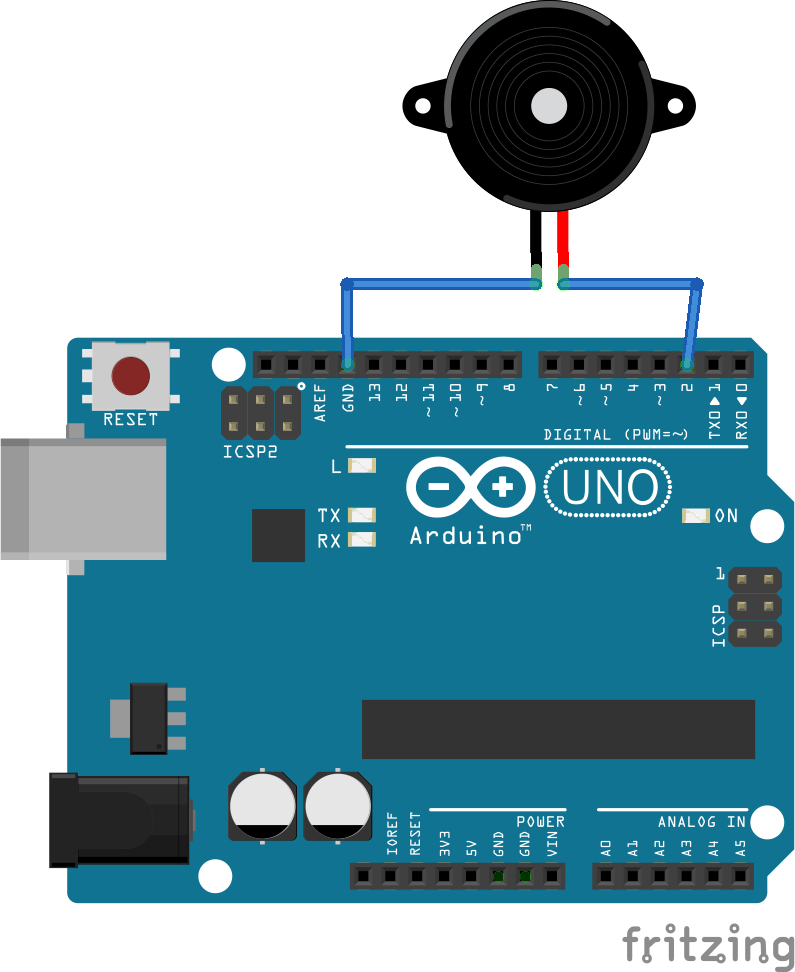

> ## About
This repository contains packages that play tunes from [Carnatic music](https://www.google.com/search?q=carnatic+music&oq=carnatic+music&aqs=chrome..69i57j69i59j69i60l3.2095j0j7&sourceid=chrome&ie=UTF-8). The software has been released under [Coffeeware license](https://github.com/jupegarnica/coffeeware-license) (Revision 2).

> ### Requirements

**Softwares**
* Arduino IDE - To build and flash the program.
* Doxygen - To generate documentation of the code.
* 
**Hardwares**
* Arduino UNO or Mega or microcontroller.
* Buzzer
* USB cable

> ## Circuit
Connect the piezo buzzer to ```PIN 9``` and ```GND``` as shown in the image below.

> ## Instructions
* Open the selected package/project of your choice in Arduino IDE.
* Select the board from ```Tools```
* Build the code.
* Upload/flash the program on the microcontroller.
* To generate documentation, issue the command ```doxygen Doxyfile```. The documentation will be generated in the ```docs``` folder.

Visit [this](https://github.com/RobotBramhana/arduino_music/wiki/Quick-compose-guide) wiki page for composing a new tune.

---

## Author
Sudhanva S
